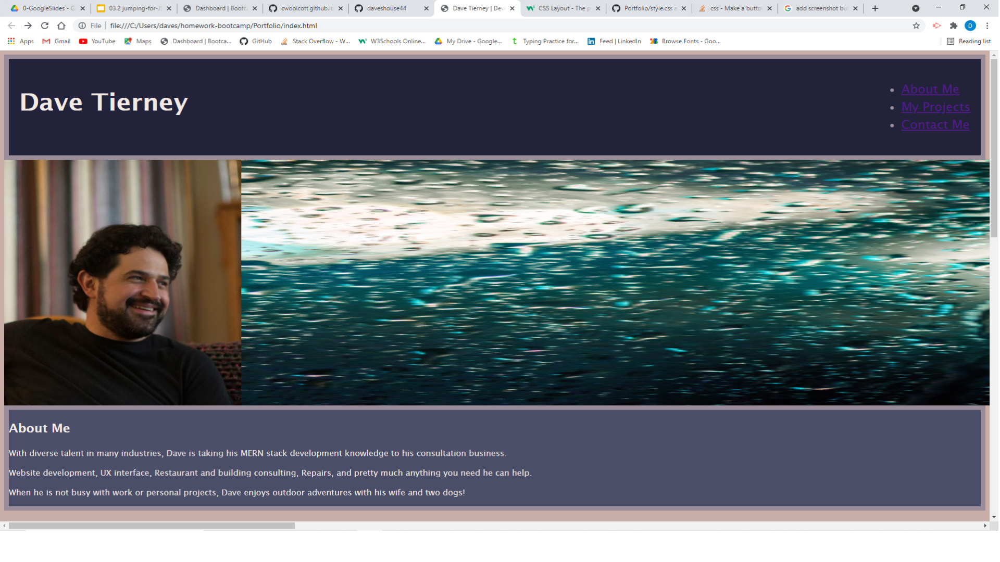

# Portfolio

With diverse talent in many industries, Dave is taking his MERN stack development knowledge to his consultation business.

Website development, UX interface, Restaurant and building consulting, Repairs, and pretty much anything you need he can help.

When he is not busy with work or personal projects, Dave enjoys outdoor adventures with his wife and two dogs!

> [Check out the full portfolio here](https://daveshouse44.github.io/Portfolio/)

## Contact Me

[GitHub](https://github.com/daveshouse44)

[LinkedIn](https://www.linkedin.com/in/david-tierney-652030214/)

[Email: daveshouse44@hotmail.com](mailto:daveshouse44@hotmail.com)